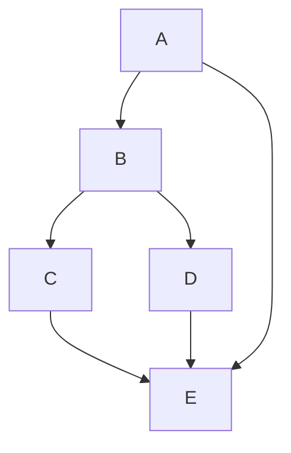
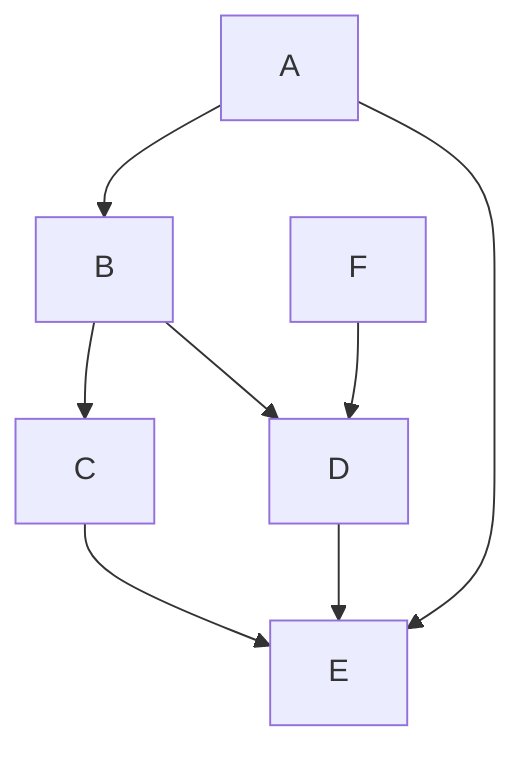
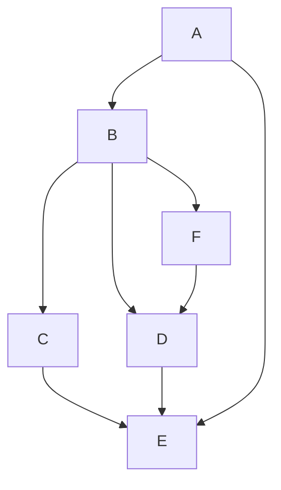

# Directed Acyclic Graph Reachability Indexing

I can't find any literature on a graph reachability index that works exactly the way I want, so here we go again

## What is this

It should be some code that lets you index a directed acyclic graph and look up in constant-ish time:

* given two nodes `u` and `v`, whether there is a path from `u` to `v`
* given one node `u`, all nodes `v'` that have a path from `u`
* given one node `v`, all nodes `u'` that have a path to `v`

## How does it work

Assuming it does actually work, the code should explain how it works.
If not this repo will probably be archived.

## Why does it work

### Starting with a trivial lookup table

Let's say I just want a basic reachability lookup table.
The rows and columns are every possible node, and the cells are `1` if there exists a path and `0` otherwise.
A DAG may be represented as such:

|     | A   | B   | C   | D   | E   |
|-----|-----|-----|-----|-----|-----|
| A   |     | 1   | 1   | 1   | 1   |
| B   |     |     | 1   | 1   | 1   |
| C   |     |     |     |     | 1   |
| D   |     |     |     |     | 1   |
| E   |     |     |     |     |     |

Lookups are pretty trivial to accomplish with this sort of index.
Also, adding a new node `F` and an arrow `F -> D` would simply require adding a new row and column:

|     | A   | B   | C   | D   | E   | F   |
|-----|-----|-----|-----|-----|-----|-----|
| A   |     | 1   | 1   | 1   | 1   |     |
| B   |     |     | 1   | 1   | 1   |     |
| C   |     |     |     |     | 1   |     |
| D   |     |     |     |     | 1   |     |
| E   |     |     |     |     |     |     |
| F   |     |     |     | 1   | 1   |     |

And this operation simply copies the reachability of `D` onto `F`, also adding one entry from `F` to `D`.
But this index does not allow the deletion of edges[^footnote-edge-deletion-1],
since it can't possibly know which paths would be affected by an edge deletion.

[^footnote-edge-deletion-1]: It might be possible to delete both nodes in the edge,
then re-add all other unaffected edges?

## Overcomplicating things

Skippable section

The obvious trick to try would be to track which paths contain which edges.
This is clearly not a scalable approach, but it illustrates why the final approach works

todo: continue story another day

## Reference counting

When we add an edge (e.g. `B -> F`), all nodes reachable from `F` are added `B` and to all nodes that can reach `B`

|     | A   | B   | C   | D   | E   | F   |
|-----|-----|-----|-----|-----|-----|-----|
| A   |     | 1   | 1   | 2   | 4   | 1   |
| B   |     |     | 1   | 2   | 3   |     |
| C   |     |     |     |     | 1   |     |
| D   |     |     |     |     | 1   |     |
| E   |     |     |     |     |     |     |
| F   |     |     |     | 1   | 1   |     |

### Maintaining the invariant

## Optimizations

Building in reverse topo order / reverse DFS (on node exit not entry) with deduplication