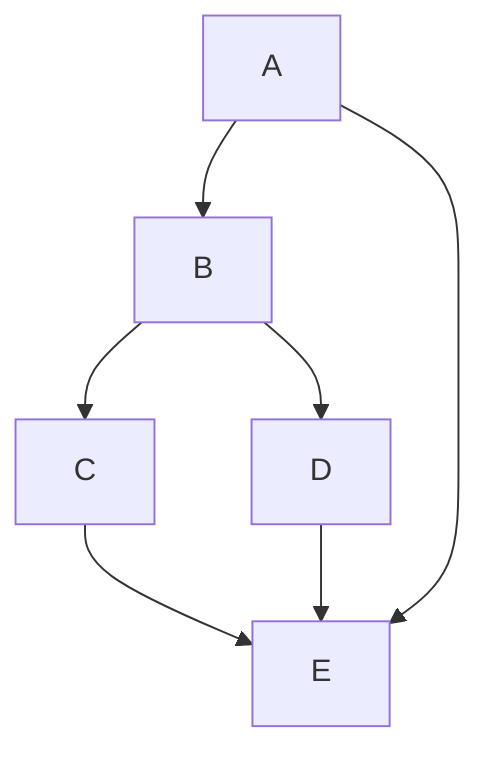
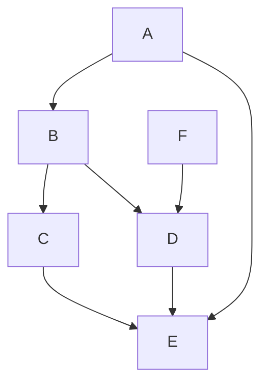
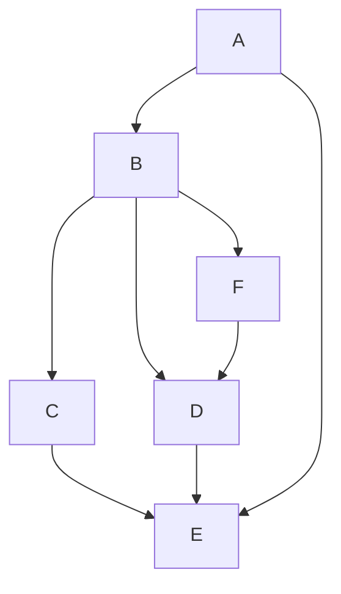
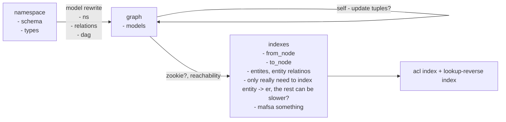

# Directed Acyclic (Multi-)Graph Reachability Indexing for Zanzibar

I can't find any literature on a graph reachability index that works exactly the way I want,
so here we go again on another ~~yak-shaving exercise~~ exploratory side project

This is all an effort to find a way to index zanzibar-like permissions for efficient lookup

## What is this

It should be some code that lets you index a directed acyclic graph and look up in constant-ish time:

* given two nodes `u` and `v`, whether there is a path from `u` to `v`
* given one node `u`, all nodes `v'` that have a path from `u`
* given one node `v`, all nodes `u'` that have a path to `v`

And it should allow addition and removal in about linear-ish time
(or constant-ish time, given some assumptions about the out-degree of nodes in the graph):

* adding an edge from `u` to `v`
* removing an edge from `u` to `v`
* adding a new node `u` with no incoming/outgoing edges
* removing a node `u` and all edges to/from `u`

And it should build an index from a given graph in no worse than polynomial time,
and shouldn't take any more than polynomial space.

All this is to help with indexing permissions in [Google Zanzibar](https://zanzibar.tech)

## How does it work

Please read the the code to understand how it works.
~~If it doesn't work then this repo will probably be archived.~~

## Why does it work

### Starting with a trivial lookup table

Let's say I just want a basic reachability lookup table.
The rows and columns are every possible node, and the cells are `1` if there exists a path and `0` otherwise.
A DAG may be represented as such:

```mermaid
flowchart TB
    A --> B
    B --> C
    B --> D
    C --> E
    D --> E
    A --> E
```

|   | A | B | C | D | E |
|---|---|---|---|---|---|
| A |   | 1 | 1 | 1 | 1 |
| B |   |   | 1 | 1 | 1 |
| C |   |   |   |   | 1 |
| D |   |   |   |   | 1 |
| E |   |   |   |   |   |

Lookups are pretty trivial to accomplish with this sort of index.
Also, adding a new node `F` and an arrow `F -> D` would simply require adding a new row and column:

```mermaid
flowchart TB
    A --> B
    B --> C
    B --> D
    C --> E
    D --> E
    A --> E
    F --> D
```

|   | A | B | C | D | E | F |
|---|---|---|---|---|---|---|
| A |   | 1 | 1 | 1 | 1 |   |
| B |   |   | 1 | 1 | 1 |   |
| C |   |   |   |   | 1 |   |
| D |   |   |   |   | 1 |   |
| E |   |   |   |   |   |   |
| F |   |   |   | 1 | 1 |   |

And this operation simply copies the reachability of `D` onto `F`, also adding one entry from `F` to `D`.
But this index does not allow the deletion of edges[^footnote-edge-deletion-1],
since it can't possibly know which paths would be affected by an edge deletion.

[^footnote-edge-deletion-1]: It might be possible to delete both nodes in the edge,
then re-add all other unaffected edges?

## Overcomplicating things

Skippable section

The obvious trick to try would be to track which paths contain which edges.
This is clearly not a scalable approach, but it illustrates why the final approach works

todo: continue story another day

### A trick from working with MAFSAs

When you have a list of strings you could build a trie, but a MAFSA is even smaller (by definition, minimal).
But how to you keep track of string indices in a MAFSA?
The trick to this is simply counting how many total word ends there are after each node.

todo: either write something or reference

## Reference counting

When we add an edge (e.g. `B -> F`), all nodes reachable from `F` are added `B` and to all nodes that can reach `B`

```mermaid
flowchart TB
    A --> B
    B --> C
    B --> D
    C --> E
    D --> E
    A --> E
    F --> D
    B --> F
```

|   | A | B | C | D | E | F |
|---|---|---|---|---|---|---|
| A |   | 1 | 1 | 2 | 4 | 1 |
| B |   |   | 1 | 2 | 3 | 1 |
| C |   |   |   |   | 1 |   |
| D |   |   |   |   | 1 |   |
| E |   |   |   |   |   |   |
| F |   |   |   | 1 | 1 |   |

### Maintaining the invariant

* remember to multiply by the incoming path count
* the graph must remain acyclic
* we need to store edges too, since we can't trivially tell from the lookup table whether a given edge exists
    * it's possible but computationally kinda slow
* node deletion requires zero incoming and outgoing paths
    * delete all edges that touch the node first
    * remember to optimize node deletion in the index
* technically it should support multiple edges between the same two nodes

## Optimizations

* Building in reverse topo order / reverse DFS (on node exit not entry) with deduplication
    * if the graph edges have a different distribution then maybe there's no difference,
      or maybe topo sort would be faster?
    * or maybe it's better to fill in every other layer of the topo sort graph first, to minimize extra calls?
* node deletion works like deleting an edge from itself
* use a sparse matrix for the edges - if it's indexed twice, then lookups and reverse lookups are both constant time
    * something like a compressed adjacency matrix?
    * the index only includes nodes if there are edges
    * garbage collect whenever any node/edge is removed
* it's possible to figure out the edges from the original index (albeit in O(n**2) time with some kind of rref-like
  algo)
  so maybe if this index is written to disk we can avoid writing the edges?
    * basically sort the nodes by the number of outgoing edges, then starting from the most edges, start subtracting
      until it's zeroed

## Transactions

* use a database
* remove one edge at a time
* add one edge at a time
* make sure not to add any edges that were removed in the same transaction, or dedupe beforehand
* rollback if a cycle is detected
* both the edge store and the index should be in the same database
* nested transactions to support adding multiple edges together?
* optimization: single transaction, but will need multiple reads and a local cache before writing

## Zanzibar

See the paper at https://zanzibar.tech

### reducing the search space when manually traversing edges

* build a state machine
* filter by node type and edge type
* in the schema graph there should only be a few possible transitions

### userset rewrites

* build rules based on schema
* basically something like
    * if tuple matches some rule (subject type, subject name, relation, object type, object name, object)
    * then clone, overwrite some params, and add another tuple
    * alternatively do it at the node level, although that requires splitting up relation into subject and object rels
* rule matching shouldn't be linear though, maybe put it in a trie structure or hash table?
    * hash table would require hashing the same tuple up to 16 times though, so maybe not the best idea?
    * then again it's still faster than backtracking through a trie
* this will also be used to handle the `*` type, rewriting all `object name` to `object *`
    * we should only set up this rule if `*` is in schema, and only for specific relations

### graph rewrite from edge-labeled to non-labeled

* tldr if user:a can access doc:b then draw from `user:a:null` -> `doc:b:access`
* this deserves more words but maybe someday

### boolean operators

Boolean relations (`and`, `but not`) are supported by the **set engine** backend
(`setengine/`), not the graph index — see [The two backends: a memoization
spectrum](#the-two-backends-a-memoization-spectrum) below. The graph index materialises
closures and cannot represent negation, so `compile_ruleset` refuses a boolean schema
loudly (`UnsupportedByGraphIndex`, naming the relation); the shared expression AST from
the parser (`Direct`/`Computed`/`TTU`/`Union`/`Intersection`/`Exclusion`) is the artifact
both backends consume.

### zookies

* some kind of transaction timestamp, maybe snowflake or ULID or uuid7 or lamport clock thingamajig
* the cache just needs to store the last updated timestamp

### `*` wildcard entities (materialized)

Wildcards are supported as a first-class, **materialized** feature in `index_v4`
(`index_v4/wildcard.py`, the `WildcardIndex` façade). We support the OpenFGA subject
wildcards `user:*` and `group:*#member`, and — as a deliberate extension beyond OpenFGA
— wildcard **objects** like `folder:*`. `check()` stays constant time (≤4 point lookups
on a unique index) regardless of data size, nesting depth, or fan-out: all wildcard hops
that can occur in the *interior* of a path are materialized as real edges at write time;
only the two hops touching the literal query endpoints stay virtual.

**Split wildcard nodes.** Each wildcard-capable shape `S = (type, predicate)` gets up to
two nodes (`NodeV4.wildcard ∈ {'', 'any', 'all'}`):

* `w_any(S)` — "some instance of S." Concrete instances bridge **into** it
  (`concrete → w_any`); grants depart **out of** it. A tuple whose *subject* is a wildcard
  produces a grant from `w_any`.
* `w_all(S)` — "all instances of S." Grants arrive **into** it; instance bridges depart
  **out of** it (`w_all → concrete`). A tuple whose *object* is a wildcard produces a grant
  into `w_all`.

There is deliberately no `w_any → w_all` bridge — that is what prevents the instance leak
`alice → user:* → bob` (being an instance must not grant what is distributed to instances).

**Position rule (uniform).** Wildcard in subject position → `w_any(subject_type,
subject_predicate)`; wildcard in object position → `w_all(object_type, relation)`. Applies
to raw and rewrite-derived tuples alike.

**Check = up to 4 probes** (ORed, short-circuiting; a missing node just makes a probe
false, which is what makes *ghost entities* work):

| # | probe | gated on |
|---|---|---|
| 1 | `(subject) → (object)` | always |
| 2 | `w_any(s_type, subject_pred) → (object)` | `(s_type, subject_pred)` is a subject-wildcard shape and `s_name != '*'` |
| 3 | `(subject) → w_all(o_type, relation)` | `(o_type, relation)` is an object-wildcard shape and `o_name != '*'` |
| 4 | `w_any(...) → w_all(...)` | both gates above |

A literal `'*'` query endpoint maps to its own variant node in probe 1 and skips its own
wildcard probe. Reads never create nodes and never recurse.

**Declaring wildcards.** Subject wildcards come from the schema: `[T:*]` marks the bare
shape `(T, '...')`, `[T:*#P]` marks the userset shape `(T, P)`. Object wildcards have no
OpenFGA syntax, so pass them to `parse_openfga_schema(schema,
object_wildcard_shapes={(object_type, relation), ...})`. Filters stay strict on the subject
(`[user]` still rejects a `user:*` subject) but permissive on the object so object-wildcard
tuples flow through ingestion; the façade validates object-wildcard shapes.

**Strict ∀⇒∃ (the only mode).** "Granted on **all** S" implies "reaches **some** S" only if
at least one concrete instance of S exists — realized structurally by
`alice → w_all(S) → concrete → w_any(S)`, which requires a real concrete in the middle.
With zero instances the implication does not hold. A per-shape lenient/vacuous mode (a
single `w_all(S) → w_any(S)` edge) is a documented future hook, not implemented.

**Cost model** (don't "fix" these — they are the accepted trade for O(1) reads):

* Plain `[user:*]`: zero bridges, zero backfill, +≤3 probes on gated checks; one edge per
  wildcard tuple. Bare shapes `(T, '...')` never need in-bridges.
* Declaring a bridged shape (`[group:*#member]`, or any object-wildcard shape) costs one
  bridge edge per concrete of that shape **plus** the closure rows connecting each bridge's
  ancestors/descendants to the `w` node — roughly one closure row per (member × group) even
  before any wildcard grant exists. **Declaration itself has a cost; only declare shapes you
  use.**
* A wildcard grant on a bridged shape fans out through the closure to every instance's
  subtree — the same row count as granting each instance explicitly. The wildcard automates
  the fan-out; nothing eliminates it while reads are O(1).

**Symbolic deltas.** `PermissionDelta`s that mention a wildcard node id are *symbolic*
("everyone of shape S gained/lost X"). They are passed through untouched; expanding them
into concrete deltas is a future post-processing layer.

**Self-referential wildcard tuples are rejected by cycle detection, and that is correct:**
`group:*#member member group:g` would make g's members include members-of-any-group
(including g's) — a genuine cycle. The façade re-raises the core's cycle error with an
explanatory message.

### rewrite from entities to nodes

* rules for what tuples can be added
* rules for rewriting tuples to add more relations
* rules about rules - no recursion, since that doesn't work (we don't have anything to recurse)
    * e.g. `group->subgroup: [group] or subgroup from subgroup`

### index guarantee

* ~~if we want to ensure writes to the index always succeed, then we need a store of ignored tuples that cause cycles~~
* ~~then we can add and remove them as no-ops~~
* ~~also the remove should always happen before the adds~~

*the above doesn't work since removing a tuple that breaks the cycle doesn't add the previously ignored tuple* 

### notes

goals:

* causality
* correctness / consistency
* generality / expressiveness
* perforamnce
* (real) availability <-- why real? might have misread the handwriting on my notes
* multi-tenancy
* cross-namespace relations?
* shared tuples / state?
* acyclic check

* conditional transitions?
* default condition exists?

```mermaid
flowchart LR
    ns["`namespace
         - schema
         - types`"]
    g["`graph
        - models`"]
    ns -->|model rewrite 
          - ns
- relations
- dag|g
g -->|self - update tuples?|g
i["`indexes
        - from_node
        - to_node
        - entites, entity relatinos
        - only really need to index entity -> er, the rest can be slower?
        - mafsa something`"]
g -->|zookie?, reachability|i
ai[acl index + lookup-reverse index]
i --> ai
```

* `*` as special entity?
* check twice, lookup twice, reverse lookup
* entity-tuple counters
    * when first added (implicitly), count number of tuple references
        * separate subject/object counts? or together?
    * when last removed (both counts hit zero), delete entity
    * use this to create/delete entity -> entity:* tuples
    * also maybe an implicit tuple flag, since explicitly created entities shouldn't be deleted

tuple workflow

1. add/remove tuple
2. filter tuple by schema
3. add/remove entity
    * add/remove entity -> entity:*
4. rewrite + expand tuple recursively by schema
5. convert to from/to nodes
6. cycle detection and addition to index

schema rewrite to rules/filters

| schema syntax                    | action type                             | action description                                                                                       |
|----------------------------------|-----------------------------------------|----------------------------------------------------------------------------------------------------------|
| `[user]`                         | filter                                  | allow edge of type `user -> object`, see [zanzibar_utils_v1](./zanzibar_utils_v1.py)                     |
| `[user:*]`                       | filter + add tuple upon entity creation | or, add the (inefficient) rules `user:?->...` -> `user:?->user:*` and  `...->user:?` -> `user:?->user:*` |
| `[group#member]`                 | filter                                  | allow edge of type `group#member -> object`, see [zanzibar_utils_v1](./zanzibar_utils_v1.py)             |
| `[group:*#member]`               | filter + ...                            | combination of the actions above                                                                         |
| `... or admin`                   | rule                                    | see [zanzibar_utils_v1](./zanzibar_utils_v1.py)                                                          |
| `... or member from owner-group` | rule                                    | see [zanzibar_utils_v1](./zanzibar_utils_v1.py)                                                          |
| `(... and ...)`                  | post-add rewrite?                       | not yet supported                                                                                        |
| `(... but not ...)`              | post add rewrite?                       | not yet supported                                                                                        |

* note: the current rewrite logic is too simple to express the second of those rules right now
* schema type checking, so that all relations always resolve to a single type?
    * or resolve by relations and do duck-typing checks instead? this is more correct maybe but also more effort
* need some way to track explicitly added tuples vs auto-included tuples?
    * auto-included tuples need not match the filters, but can match rules
    * also maybe some way to ensure the rules don't end up being recursive
    * might be possible to pre-compile match and rewrite rules into a flat list with multiple rewrites for efficiency
    * and compile the match rules into something like a trie for efficiency

## The two backends: a memoization spectrum

The repo now ships **two evaluation backends with identical semantics and opposite cost
models** — they are the two endpoints of a single memoization spectrum:

* the **graph index** (`index_v4`, `WildcardIndex`) memoizes *everything at write time*.
  It materialises the full transitive closure (plus wildcard bridges) as ref-counted
  edges, so `check` is O(1) — at most a few point lookups on the unique edge index,
  independent of data size or nesting depth. Writes pay for that: each write updates the
  closure, and boolean relations can't be represented at all.
* the **set engine** (`setengine/`) memoizes *nothing across queries*. It stores only the
  raw tuples (`TupleV1`) and computes memberships on the fly with bitmap algebra. Writes
  are O(1) in-memory updates; reads are O(schema depth × topology) with the bulk set work
  vectorized. In exchange it supports boolean operators (`and`, `but not`) the closure
  index cannot. Interning is **reference-counted**: the `(type, name, predicate)` key is
  the immutable surrogate identity, the int32 id is a reusable handle, and when the last
  tuple mentioning an entity is removed its id (and mapping) is freed and recycled — so
  in-memory size tracks the *live* entity count, not the lifetime count, and high churn of
  temporary entities cannot leak (nor exhaust the uint32 id domain).

**Identifier validation.** Surrogate identities (entity types, entity names, relations)
are constrained on every write — in *both* backends — to a strict, delimiter-free charset
`[A-Za-z0-9_./@+=-]` (1–256 chars; a name may also be the wildcard `*`, a subject
predicate the bare `...`). This keeps DSL/parsing delimiters, whitespace, quotes, control
bytes, and injection payloads out of identity strings entirely (SQL is parameterized
regardless, so this is defense-in-depth). Internal ids stay strictly numeric, decoupled
from these strings.

Same questions, same answers, opposite place to spend the work. The **validation matrix**
(`tests/test_matrix.py`) is what pins "same semantics": a 4-way comparison
(handwritten expectations · reference oracle · set engine · graph `WildcardIndex`) over
the union+wildcard fixtures, and a 3-way comparison (handwritten · oracle · set engine)
over the boolean fixtures, with `check` compared across all backends over the full query
grid after every operation — under **both** set representations.

### Cost model

| | graph index | set engine |
|---|---|---|
| write | O(closure delta) — materialises transitive edges + bridges | O(1) — append a raw tuple, update three in-memory maps |
| `check` | O(1) point lookups on the closure | O(schema depth × topology), memoized per query |
| booleans (`and` / `but not`) | ✗ refused (`UnsupportedByGraphIndex`) | ✓ |
| deltas (`PermissionDelta`) | ✓ | ✗ (returns `[]`) |
| storage | derived closure edges | raw tuples only (ground truth) |

### Set representation (`SetOps`)

All set state and algebra go through a thin pluggable seam (`setengine/setops.py`), a
factory pair selected at construction: `RoaringSets` (`pyroaring`, default) or `PySets`
(builtin `set`/`frozenset`). Builtin sets tend to win on small, membership-heavy work
(`check`); roaring wins on large populations and bulk union/intersection/difference (the
`expand` path). The benchmark (`benchmarks/set_engine_bench.py`) makes the trade concrete;
the whole test matrix runs under both and asserts they are indistinguishable.

### Star × boolean semantics

A `'*'`-named query subject is evaluated **intensionally, per branch** — "does a grant
flow through the wildcard", not "does every concrete instance happen to qualify":

| query subject | `A and B` | `A but not B` |
|---|---|---|
| `'*'` (star) | star-covered in **both** | star-covered in A and **not** star-covered in B |
| concrete `u` | `u ∈ A` and `u ∈ B` | `u ∈ A` and `u ∉ B` (genuine pointwise) |
| ghost `g` | (same as concrete) | (same as concrete) |

So a concrete-only exclusion (`A but not bob`) does **not** defeat a `'*'` query of `A`:
the star is still covered in `A`, and bob's individual removal is not a star in `B`. The
set engine's `MemberSet` (`pos` / `stars` / `neg`) reproduces this table by construction;
a shared property suite asserts the oracle and the `MemberSet` algebra agree on it.

### Non-goals (documented hooks only)

Cross-query caching / version-counter invalidation; bitmap snapshot persistence
(`BitMap.serialize()` blobs — state is in-memory, rebuilt from `TupleV1` on open); deltas
from the set engine; wiring the graph backend through `TupleV1` (harness-level fan-out
only — `WildcardIndex` is finished code); boolean support *in the graph backend* (a future
check-time expression layer over `WildcardIndex.check` that would consume the same shared
AST); 64-bit id space; any query-time node interning.

# TODO

* re-introduce invariant checks for the index v3, and think of more checks
* re-introduce randomized testing for v3
* support tracking user-triples and rule-triples in the index
* parse the fga schema (json) into filters and rewrite rules
* store the filters and rewrite rules in the database
* support namespacing within the database
    * or just use a new database each time? probably better for it to be in the database though
* figure out how to implement boolean operations with post-processing
* output the new edges and newly removed edges for external indexing
