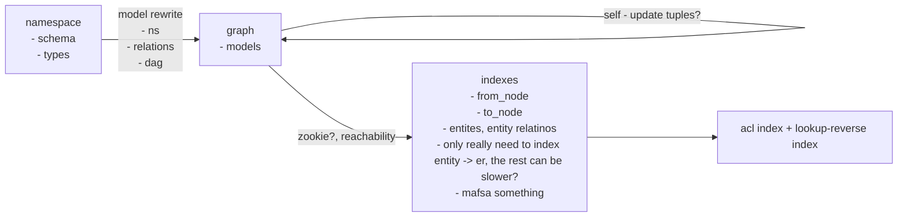

# Directed Acyclic (Multi-)Graph Reachability Indexing for Zanzibar

I can't find any literature on a graph reachability index that works exactly the way I want,
so here we go again on another ~~yak-shaving exercise~~ exploratory side project

This is all an effort to find a way to index zanzibar-like permissions for efficient lookup

## What is this

It should be some code that lets you index a directed acyclic graph and look up in constant-ish time:

* given two nodes `u` and `v`, whether there is a path from `u` to `v`
* given one node `u`, all nodes `v'` that have a path from `u`
* given one node `v`, all nodes `u'` that have a path to `v`

And it should allow addition and removal in about linear-ish time
(or constant-ish time, given some assumptions about the out-degree of nodes in the graph):

* adding an edge from `u` to `v`
* removing an edge from `u` to `v`
* adding a new node `u` with no incoming/outgoing edges
* removing a node `u` and all edges to/from `u`

And it should build an index from a given graph in no worse than polynomial time,
and shouldn't take any more than polynomial space.

All this is to help with indexing permissions in [Google Zanzibar](https://zanzibar.tech)

## How does it work

Please read the the code to understand how it works.
~~If it doesn't work then this repo will probably be archived.~~

## Why does it work

### Starting with a trivial lookup table

Let's say I just want a basic reachability lookup table.
The rows and columns are every possible node, and the cells are `1` if there exists a path and `0` otherwise.
A DAG may be represented as such:

|   | A | B | C | D | E |
|---|---|---|---|---|---|
| A |   | 1 | 1 | 1 | 1 |
| B |   |   | 1 | 1 | 1 |
| C |   |   |   |   | 1 |
| D |   |   |   |   | 1 |
| E |   |   |   |   |   |

Lookups are pretty trivial to accomplish with this sort of index.
Also, adding a new node `F` and an arrow `F -> D` would simply require adding a new row and column:

|   | A | B | C | D | E | F |
|---|---|---|---|---|---|---|
| A |   | 1 | 1 | 1 | 1 |   |
| B |   |   | 1 | 1 | 1 |   |
| C |   |   |   |   | 1 |   |
| D |   |   |   |   | 1 |   |
| E |   |   |   |   |   |   |
| F |   |   |   | 1 | 1 |   |

And this operation simply copies the reachability of `D` onto `F`, also adding one entry from `F` to `D`.
But this index does not allow the deletion of edges[^footnote-edge-deletion-1],
since it can't possibly know which paths would be affected by an edge deletion.

[^footnote-edge-deletion-1]: It might be possible to delete both nodes in the edge,
then re-add all other unaffected edges?

## Overcomplicating things

Skippable section

The obvious trick to try would be to track which paths contain which edges.
This is clearly not a scalable approach, but it illustrates why the final approach works

todo: continue story another day

### A trick from working with MAFSAs

When you have a list of strings you could build a trie, but a MAFSA is even smaller (by definition, minimal).
But how to you keep track of string indices in a MAFSA?
The trick to this is simply counting how many total word ends there are after each node.

todo: either write something or reference

## Reference counting

When we add an edge (e.g. `B -> F`), all nodes reachable from `F` are added `B` and to all nodes that can reach `B`

|   | A | B | C | D | E | F |
|---|---|---|---|---|---|---|
| A |   | 1 | 1 | 2 | 4 | 1 |
| B |   |   | 1 | 2 | 3 | 1 |
| C |   |   |   |   | 1 |   |
| D |   |   |   |   | 1 |   |
| E |   |   |   |   |   |   |
| F |   |   |   | 1 | 1 |   |

### Maintaining the invariant

* remember to multiply by the incoming path count
* the graph must remain acyclic
* we need to store edges too, since we can't trivially tell from the lookup table whether a given edge exists
    * it's possible but computationally kinda slow
* node deletion requires zero incoming and outgoing paths
    * delete all edges that touch the node first
    * remember to optimize node deletion in the index
* technically it should support multiple edges between the same two nodes

## Optimizations

* Building in reverse topo order / reverse DFS (on node exit not entry) with deduplication
    * if the graph edges have a different distribution then maybe there's no difference,
      or maybe topo sort would be faster?
    * or maybe it's better to fill in every other layer of the topo sort graph first, to minimize extra calls?
* node deletion works like deleting an edge from itself
* use a sparse matrix for the edges - if it's indexed twice, then lookups and reverse lookups are both constant time
    * something like a compressed adjacency matrix?
    * the index only includes nodes if there are edges
    * garbage collect whenever any node/edge is removed
* it's possible to figure out the edges from the original index (albeit in O(n**2) time with some kind of rref-like
  algo)
  so maybe if this index is written to disk we can avoid writing the edges?
    * basically sort the nodes by the number of outgoing edges, then starting from the most edges, start subtracting
      until it's zeroed

## Transactions

* use a database
* remove one edge at a time
* add one edge at a time
* make sure not to add any edges that were removed in the same transaction, or dedupe beforehand
* rollback if a cycle is detected
* both the edge store and the index should be in the same database
* nested transactions to support adding multiple edges together?
* optimization: single transaction, but will need multiple reads and a local cache before writing

## Zanzibar

See the paper at https://zanzibar.tech

### reducing the search space when manually traversing edges

* build a state machine
* filter by node type and edge type
* in the schema graph there should only be a few possible transitions

### userset rewrites

* build rules based on schema
* basically something like
    * if tuple matches some rule (subject type, subject name, relation, object type, object name, object)
    * then clone, overwrite some params, and add another tuple
    * alternatively do it at the node level, although that requires splitting up relation into subject and object rels
* rule matching shouldn't be linear though, maybe put it in a trie structure or hash table?
    * hash table would require hashing the same tuple up to 16 times though, so maybe not the best idea?
    * then again it's still faster than backtracking through a trie
* this will also be used to handle the `*` type, rewriting all `object name` to `object *`
    * we should only set up this rule if `*` is in schema, and only for specific relations

### graph rewrite from edge-labeled to non-labeled

* tldr if user:a can access doc:b then draw from `user:a:null` -> `doc:b:access`
* this deserves more words but maybe someday

### boolean operators

* requires post-processing, too much effort for now

### zookies

* some kind of transaction timestamp, maybe snowflake or ULID or uuid7 or lamport clock thingamajig
* the cache just needs to store the last updated timestamp

### `*` wildcard entities

* although * can't be an object in openfga, i see no reason not to support it
* tldr do checks up to 4 times:
    * user:a access doc:x
    * user:* access doc:x
    * user:a access doc:*
    * user:* access doc:*
    * (depending on whether there exists a relation access:doc:* or user:*:access in the schema)
* do lookups twice:
    * user:a access doc:?
    * user:* access doc:?
    * and if ? contains * then return all docs

### rewrite from entities to nodes

* rules for what tuples can be added
* rules for rewriting tuples to add more relations
* rules about rules - no recursion, since that doesn't work (we don't have anything to recurse)
    * e.g. `group->subgroup: [group] or subgroup from subgroup`

### index guarantee

* ~~if we want to ensure writes to the index always succeed, then we need a store of ignored tuples that cause cycles~~
* ~~then we can add and remove them as no-ops~~
* ~~also the remove should always happen before the adds~~

*the above doesn't work since removing a tuple that breaks the cycle doesn't add the previously ignored tuple* 

### notes

goals:

* causality
* correctness / consistency
* generality / expressiveness
* perforamnce
* (real) availability <-- why real? might have misread the handwriting on my notes
* multi-tenancy
* cross-namespace relations?
* shared tuples / state?
* acyclic check

* conditional transitions?
* default condition exists?

* `*` as special entity?
* check twice, lookup twice, reverse lookup
* entity-tuple counters
    * when first added (implicitly), count number of tuple references
        * separate subject/object counts? or together?
    * when last removed (both counts hit zero), delete entity
    * use this to create/delete entity -> entity:* tuples
    * also maybe an implicit tuple flag, since explicitly created entities shouldn't be deleted

tuple workflow

1. add/remove tuple
2. filter tuple by schema
3. add/remove entity
    * add/remove entity -> entity:*
4. rewrite + expand tuple recursively by schema
5. convert to from/to nodes
6. cycle detection and addition to index

schema rewrite to rules/filters

| schema syntax                    | action type                             | action description                                                                                       |
|----------------------------------|-----------------------------------------|----------------------------------------------------------------------------------------------------------|
| `[user]`                         | filter                                  | allow edge of type `user -> object`, see [zanzibar_utils_v1](./zanzibar_utils_v1.py)                     |
| `[user:*]`                       | filter + add tuple upon entity creation | or, add the (inefficient) rules `user:?->...` -> `user:?->user:*` and  `...->user:?` -> `user:?->user:*` |
| `[group#member]`                 | filter                                  | allow edge of type `group#member -> object`, see [zanzibar_utils_v1](./zanzibar_utils_v1.py)             |
| `[group:*#member]`               | filter + ...                            | combination of the actions above                                                                         |
| `... or admin`                   | rule                                    | see [zanzibar_utils_v1](./zanzibar_utils_v1.py)                                                          |
| `... or member from owner-group` | rule                                    | see [zanzibar_utils_v1](./zanzibar_utils_v1.py)                                                          |
| `(... and ...)`                  | post-add rewrite?                       | not yet supported                                                                                        |
| `(... but not ...)`              | post add rewrite?                       | not yet supported                                                                                        |

* note: the current rewrite logic is too simple to express the second of those rules right now
* schema type checking, so that all relations always resolve to a single type?
    * or resolve by relations and do duck-typing checks instead? this is more correct maybe but also more effort
* need some way to track explicitly added tuples vs auto-included tuples?
    * auto-included tuples need not match the filters, but can match rules
    * also maybe some way to ensure the rules don't end up being recursive
    * might be possible to pre-compile match and rewrite rules into a flat list with multiple rewrites for efficiency
    * and compile the match rules into something like a trie for efficiency

# TODO

* re-introduce invariant checks for the index v3, and think of more checks
* re-introduce randomized testing for v3
* support tracking user-triples and rule-triples in the index
* parse the fga schema (json) into filters and rewrite rules
* store the filters and rewrite rules in the database
* support namespacing within the database
    * or just use a new database each time? probably better for it to be in the database though
* figure out how to implement boolean operations with post-processing
* output the new edges and newly removed edges for external indexing
