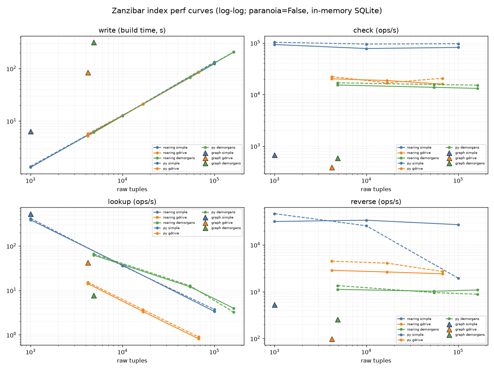

# Perf-curve analysis — 2026-07-14

Fitted scaling laws and a **PySets vs RoaringSets** comparison over the pre-perf
baseline (`scale_bench.jsonl`, 21 rows: `set:roaring` ×9, `set:py` ×9, `graph`
×3 — one session, `paranoia=False`, in-memory SQLite). Raw throughput/RSS tables
and reproduce commands live in [`BASELINE_2026-07-13.md`](BASELINE_2026-07-13.md);
this file is the *analysis*.

Regenerate:

```bash
PY="C:/Users/avery/anaconda3/envs/graph-reachability-zanzibar-index/python.exe"
"$PY" -m benchmarks.analyze       # dependency-free: fits + ratio tables (markdown)
"$PY" -m benchmarks.plot_curves   # needs matplotlib (benchmarks/requirements-analysis.txt)
```



Log-log axes, so the slope *is* the exponent: a flat line is O(1), a −45° line is
O(N). Colour = workload, solid = RoaringSets, dashed = PySets, triangles = the
graph index (one scale each).

## Scaling laws (log-log least-squares fit)

Per-op **cost** exponent = −(throughput slope); **write** is fit on build-time vs
tuples (slope ≈ 1 ⇒ linear load). Fits are over 3 scale points/curve; R² shown.

| impl | workload | surface | slope | R² | law |
|---|---|---|--:|--:|---|
| set:roaring | simple    | write | +0.99 | 1.000 | **O(N)** linear |
| set:roaring | simple    | check | −0.03 | 0.49 | **O(1)** flat |
| set:roaring | simple    | lookup | −1.03 | 1.000 | **O(N)** |
| set:roaring | simple    | reverse | −0.03 | 0.48 | **O(1)** flat |
| set:roaring | gdrive    | lookup | −1.03 | 1.000 | **O(N)** |
| set:roaring | gdrive    | reverse | −0.06 | 0.999 | **O(1)** flat |
| set:roaring | demorgans | lookup | −0.77 | 0.989 | ~O(N^0.8) |
| set:roaring | demorgans | reverse | −0.01 | 0.25 | **O(1)** flat |
| set:py | simple    | check | −0.01 | 0.59 | **O(1)** flat |
| set:py | simple    | lookup | −1.02 | 0.999 | **O(N)** |
| set:py | simple    | **reverse** | **−0.69** | 0.885 | **~O(N^0.7)** ⚠ |
| set:py | gdrive    | lookup | −1.02 | 1.000 | **O(N)** |
| set:py | gdrive    | reverse | −0.18 | 0.884 | ~flat |
| set:py | demorgans | lookup | −0.83 | 0.974 | ~O(N^0.8) |
| set:py | demorgans | reverse | −0.12 | 0.982 | ~flat |

(write and check fit identically across workloads for both backends: write
+0.97…+1.01 @ R²=1.000; check −0.01…−0.08, i.e. flat. Full table:
`python -m benchmarks.analyze`.)

**What the exponents say.**

- **write — O(N), both backends.** Load time is linear in tuple count (≈780
  writes/s regardless of N); nothing super-linear in the set-engine write path.
- **check — O(1), flat.** Confirmed to 10⁵ tuples. A check walks only the query's
  neighborhood, never the store. (Low R² is just tiny noise around a flat line.)
- **lookup — O(N).** The clean slope −1.03 @ **R²=1.000** on simple/gdrive is a
  textbook confirmation that set-engine `lookup` is an O(stored-tuples) candidate
  sweep (`engine.py:821`). demorgans is ~O(N^0.8) — slightly shallower because its
  result set *also* grows with N (mean lookup result 245 → 3,560 ids), so the
  time-box caps completed iterations rather than the sweep alone setting the rate.
- **reverse — O(1) for RoaringSets; O(N^0.7) for PySets on `simple` ⚠.** This
  looks backend-specific but isn't: `direct_expand` copies the whole type
  population per call (`engine.py:768`), which is O(N) work for *both* backends —
  PySets surfaces it (Python set copy), RoaringSets hides it (fast C bitmap copy).
  A one-line fix removes the copy and flattens both. See PySets-vs-Roaring and
  optimization target #1.

## PySets vs RoaringSets

Ratio = roaring rate / py rate; **>1 ⇒ Roaring faster, <1 ⇒ PySets faster.**

| workload | tuples | write | check | lookup | reverse |
|---|--:|--:|--:|--:|--:|
| simple    | 1,000   | 1.04 | 0.91 | 0.93 | 0.68 |
| simple    | 10,000  | 1.00 | 0.82 | 1.03 | 1.32 |
| simple    | 100,000 | 1.08 | 0.85 | 0.90 | **13.97** |
| gdrive    | 4,200   | 1.11 | 0.91 | 0.93 | 0.64 |
| gdrive    | 16,800  | 0.98 | 1.11 | 0.91 | 0.65 |
| gdrive    | 67,200  | 0.98 | 0.77 | 0.91 | 0.89 |
| demorgans | 4,850   | 1.00 | 0.91 | 0.94 | 0.83 |
| demorgans | 54,250  | 1.01 | 0.88 | 0.95 | 1.07 |
| demorgans | 162,750 | 1.01 | 0.87 | 1.23 | 1.23 |
| **geomean** | | **1.02** | **0.89** | **0.97** | **1.20** |

- **write ≈ tie** (1.02×) — both just append tuples; the bitmap backend adds
  nothing at write time.
- **check: PySets ~12% faster** (0.89× geomean). These are tiny-set pointwise
  traversals; Python's native `set` beats the pyroaring FFI overhead. (Matches the
  micro-benchmark: roaring only pulls ahead on *bulk* `expand`, ~33× — see
  `BASELINE_2026-07-13.md`.)
- **lookup ≈ tie** (0.97×) — both are dominated by the same O(N) `check` sweep, so
  the per-check backend difference washes out.
- **reverse: RoaringSets wins overall (1.20×), and *decisively at scale*** — at
  100k tuples on `simple`, PySets reverse is **14× slower** (2.0k vs 27k/s,
  reproduced). **Root-caused (not GC):** `direct_expand` at `engine.py:768` does
  `ops.new(ns.entities) & ops.new(pop((rtype,'...')))`, and `pop(...)` already
  returns the *persistent* type-population mask (`population()`, engine.py:270).
  The redundant `ops.new()` **copies the entire N-element population every call**,
  just to intersect it against ~4 entities — O(population) per expand, regardless
  of the tiny result. PySets pays it as a Python `set(100k)` copy (the cliff);
  RoaringSets pays it as a fast C `BitMap` copy (looks flat). Disabling GC does
  **not** help (1.79k → 1.85k), and a fixed-key expand craters identically —
  confirming allocation-copy, not GC. **Verified fix** — drop the redundant copy
  (`ops.new(ns.entities) & pop(...)`, `&` returns a new set so the mask is
  untouched): the intersection goes **flat** on both backends (py **1,614 →
  2.93M/s at 100k, 1817×**; roaring 2.8×). **Applied 2026-07-14** (see *Applied*):
  end-to-end simple reverse is now flat — PySets **1,944 → 57,136/s at 100k (29×)**,
  RoaringSets 27k → 35k. The baseline tables/plot above are the *pre-fix* snapshot.

**Verdict:** `RoaringSets` remains the right default (it is) — it never regresses
asymptotically and holds reverse flat at scale. `PySets` is a legitimate, slightly
faster choice for **check-dominated, small-store** workloads, but its reverse
scaling makes it a poor fit for reverse-heavy or large stores.

## Graph index (3 anchor points)

Only one scale/workload (build is 15–156 writes/s), so no slope — but the levels
confirm the design: graph reads are DB-round-trip-bound and flat
(check 388–682/s, reverse 99–530/s), and graph **lookup is flat and beats the set
engine once N is nontrivial** (simple: graph 534/s vs set 3.4/s at 100k) — the
materialized closure is the O(1) answer to the set engine's O(N) sweep.

## Applied

- ✅ **`direct_expand` population copy (`engine.py:768`) — FIXED 2026-07-14.**
  Dropped the redundant `ops.new()` around the persistent population mask
  (`ops.new(ns.entities) & pop((rtype,'...'))`). Turned the reverse/expand direct
  path from O(population) to O(result). **End-to-end (simple reverse): PySets
  1,944 → 57,136/s at 100k — now flat across 1k–100k (29×); RoaringSets 27k →
  35k.** Behavior-preserving, so no Lean change (CLAUDE.md); gated by the full
  suite (**794 passed**).
  - **Not** dropped in the sibling `memberset._starpop` (star path): the
    `Population` callable there may return a bare iterable (the memberset tests
    pass plain tuples), so `ops.new()` is load-bearing as a normalizer, not just a
    copy. Removing it broke `test_memberset_algebra_homomorphism`. See target #2.

## Optimization targets (ranked)

1. **`memberset._starpop` population copy (`memberset.py:87`).** Same O(population)
   copy, but on the *star* path (star-heavy workloads: wide/demorgans). Can't just
   drop `ops.new()` (contract: `pop` may yield a bare iterable). Needs a `SetOps`
   bulk-union primitive that accepts an iterable without a full intermediate copy,
   or an engine-level guarantee that `pop` returns an ops set. Medium risk.
2. **set-engine `lookup` — O(N) → aim for O(result).** Biggest structural win:
   both backends, R²=1.000 linear, and the graph already demonstrates the flat
   alternative. A reverse/per-subject index removes the full-store candidate
   sweep. *(Algorithm change — updates the Lean model per CLAUDE.md's "Perf work &
   the Lean model" note.)*
3. **graph write path** (closure materialization + boolean `backfill()`), 15–156
   writes/s — the only thing blocking graph numbers at scale.
4. check and reverse (roaring) are already O(1) and fast — low leverage.

## Notes

- Single session, `paranoia=False`, in-memory SQLite. Run-to-run variance ≈ ±10%
  (set) / ±15% (low-throughput graph reads); the 14× reverse gap and the O(N)
  lookup slope are far outside that band, i.e. real.
- `analyze.py` is dependency-free (reproducible anywhere); `plot_curves.py` needs
  matplotlib (`benchmarks/requirements-analysis.txt`). numpy was **not** required —
  the fits are hand-rolled log-log least squares.
