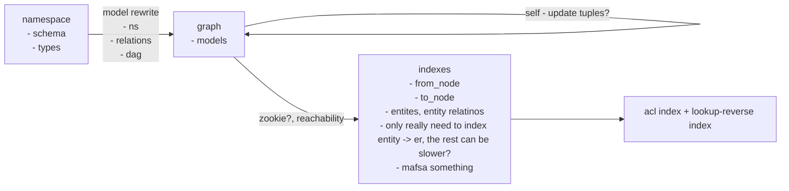

* causality
* correctness / consistency
* generality / expressiveness
* perforamnce
* (real) availability
* multi-tenancy
* cross-namespace relations?
* shared tuples / state?

* conditional transition
* default condition exists?
* acyclic check?

* `*` as special entity?
* check twice, lookup twice, reverse lookup
* entity-tuple counters
    * when first added (implicitly), count number of tuple references
        * separate subject/object counts? or together?
    * when last removed (both counts hit zero), delete entity
    * use this to create/delete entity -> entity:* tuples
    * also maybe an implicit tuple flag, since explicitly created entities shouldn't be deleted

tuple workflow

1. add/remove tuple
2. filter tuple by schema
3. add/remove entity
    * add/remove entity -> entity:*
4. rewrite + expand tuple recursively by schema
5. convert to from/to nodes
6. cycle detection and addition to index

schema rewrite to rules/filters

* `[user]` -> filter
* `[group#member]` -> filter
* `[user:*]` -> filter + add tuple upon entity creation
    * or add the (inefficient) rules `user:?->...` -> `user:?->user:*` and  `...->user:?` -> `user:?->user:*`
        * note: the current rewrite logic is too simple to express the second of those rules right now
    * but more efficient to count entity usage and only add once
* `or admin` -> rule
* `or member from owner-group` -> rule
* `(... and ...)` -> post-add rewrite?
* `(... but not ...)` -> post add rewrite?
* schema type checking, so that all relations always resolve to a single type?
    * or resolve by relations and do duck-typing checks instead? this is more correct maybe but also more effort
* need some way to track explicitly added tuples vs auto-included tuples?
    * auto-included tuples need not match the filters, but can match rules
    * also maybe some way to ensure the rules don't end up being recursive
    * might be possible to pre-compile match and rewrite rules into a flat list with multiple rewrites for efficiency
    * and compile the match rules into something like a trie for efficiency

