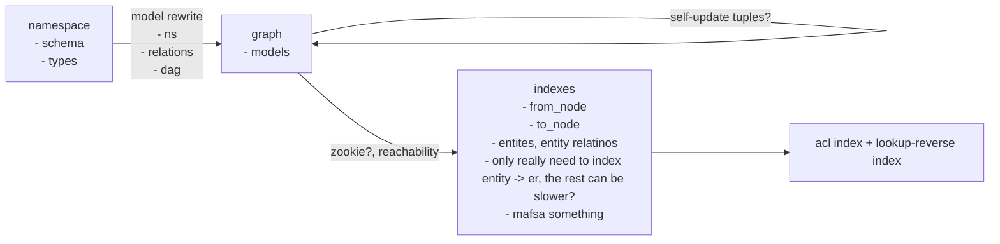

* causality
* correctness / consistency
* generality / expressiveness
* perforamnce
* (real) availability
* multi-tenancy
* cross-namespace relations?
* shared tuples / state?

* conditional transition
* default condition exists?
* acyclic check?

* `*` as special entity?
* check twice, lookup twice, reverse lookup
* 

